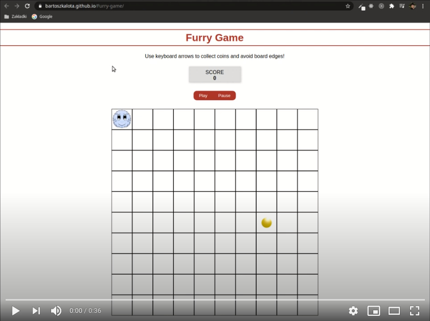

# Furry Game (Workshop-4)
The 'Furry Game' prepared in JavaScript (ES6) and jQuery as the part of the Coders Lab course.

# Live demo
https://bartoszkalota.github.io/Furry-game/

# Video demo

# Information
You control the **Furry** on the board (with keyboard arrows) and collect coins. The coins appear in random fields. Collision with board edges ends the game.

# Technologies
* JS (ES6)
* jQuery
* WebPack
* HTML, CSS